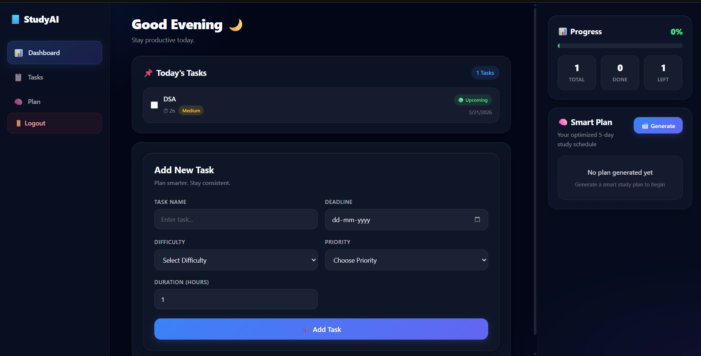
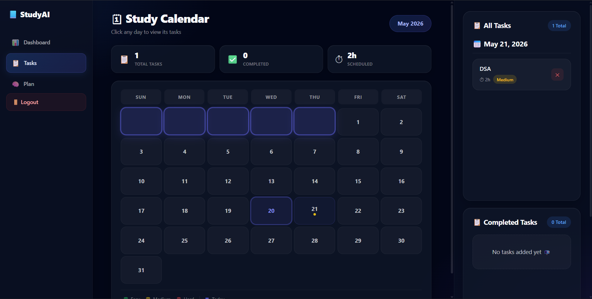
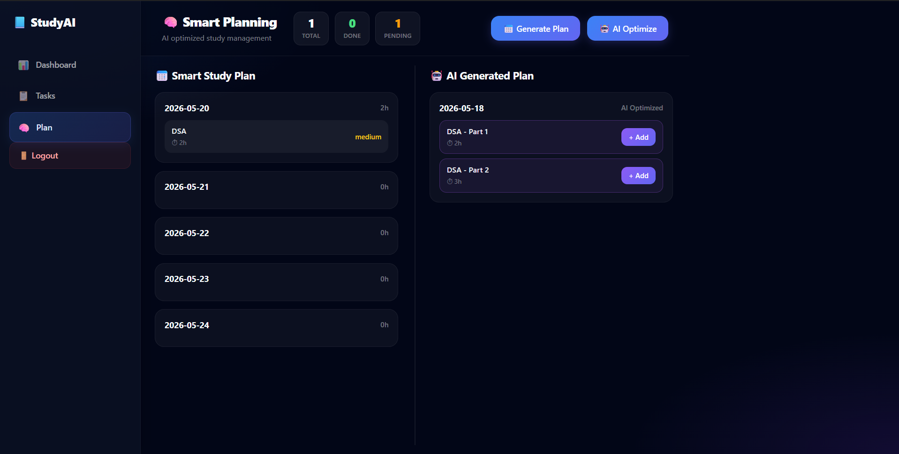

# 📘 StudyAI

An AI-powered study planning application that helps students organize tasks, generate smart study schedules, and optimize their workload using AI.

## 🚀 Live Demo

Frontend: https://study-planner-1-qnul.onrender.com/

Backend: https://study-planner-3g8y.onrender.com/

## ✨ Features

- 🔐 User Authentication (Signup/Login)
- 📋 Task Management
  - Add Tasks
  - Delete Tasks
  - Mark Tasks as Completed
- 📅 Smart 5-Day Study Plan Generation
- 🤖 AI Study Plan Optimization
- 📊 Progress Tracking Dashboard
- 📆 Calendar-based Task Organization
- 📱 Responsive UI
- ☁️ Cloud Deployment

## 🛠 Tech Stack

### Frontend
- React.js
- React Router
- CSS Modules
- Vite

### Backend
- Node.js
- Express.js
- JWT Authentication
- bcrypt

### Database
- MongoDB Atlas

### AI
- Groq API
- Llama 3.1

### Deployment
- Render (Frontend)
- Render (Backend)
- MongoDB Atlas

---

## 📸 Screenshots

### Dashboard



### Tasks Page



### Study Plan



---

## ⚙️ Installation

### Clone Repository

```bash
git clone https://github.com/sumit4861/study-planner
cd study-planner
```

### Backend Setup

```bash
cd backend
npm install
```

Create `.env`

```env
MONGO_URI=your_mongodb_uri
JWT_SECRET=your_secret
GROQ_API_KEY=your_groq_api_key
PORT=5000
```

Start backend:

```bash
npm start
```

### Frontend Setup

```bash
cd frontend
npm install
```

Create `.env`

```env
VITE_API_URL=http://localhost:5000
```

Run frontend:

```bash
npm run dev
```

---

## 📂 Project Structure

```text
study-ai
│
├── backend
│   ├── models
│   ├── middleware
│   ├── utils
│   └── server.js
│
├── frontend
│   ├── src
│   │   ├── components
│   │   ├── pages
│   │   ├── styles
│   │   └── App.jsx
│
└── README.md
```

---

## 🎯 Future Improvements

- Drag & Drop Task Scheduling
- PDF Export
- Email Reminders
- Dark Mode
- Weekly Analytics
- Study Streak Tracking
- AI Task Prioritization

---

## 👨‍💻 Author

Sumit

B.Tech CSE, NIT Warangal

GitHub: https://github.com/sumit4861